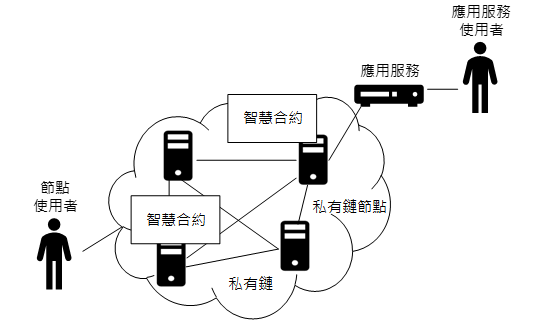
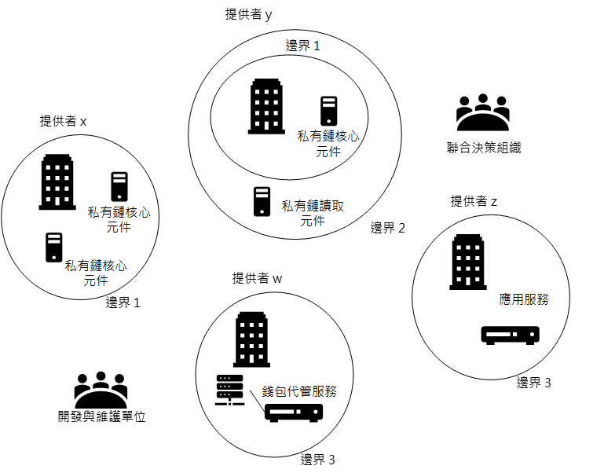
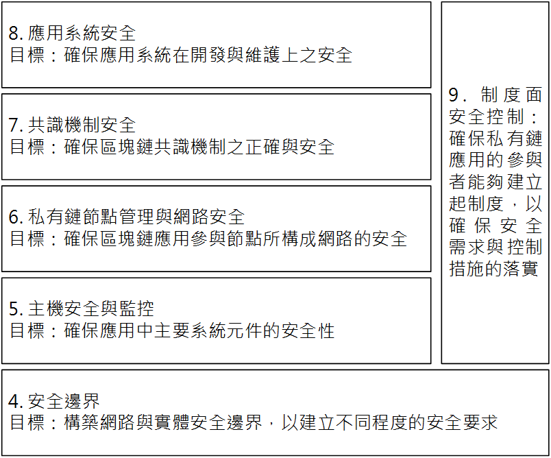

<!-- ---
layout: single
title:   "存取控制1: 定防火牆限制未經授權存取"
excerpt: "需求目標：確認私有區塊鏈應用提供者是否已經建立好安全邊界，以限制未經授權的實體或邏輯存取，並進一步透過安全邊界的設定而釐清檢查範圍。" 
date: 2021-06-06 # update-time
header:
  overlay_image: /assets/images/header/background.png # 圖片
#   caption: "Photo credit: [**Unsplash**](https://www.pexels.com/zh-tw/search/earth/)" # 可以表示圖片來源
#   overlay_filter: rgba(255,255,255,0.1)
  overlay_color: "#333" # 在純黑背景
  actions:
    - label: "Download PDF"
      url: "/assets/files/SmartIoT2021final.pdf" # 可以讓別人下載檔案

toc: true
toc_sticky: true
toc_icon: "ellipsis-h" # fontawesome

sidebar:
  nav: "blockchain"
--- -->

# 關於私有區塊鍊
本文件主要點出私有區塊鏈應用安全上應該要考慮到的項目。乃至於能夠呈現私有區塊鏈應用的安全風險。

> 圖 1.1 私有區塊鏈應用概念

圖 1.1 為私有區塊鏈應用之概念，私有區塊鏈網路是由私有鏈節點所構成的。私有區塊鏈網路最大的特色，就是可以限制所參與的節點及每個節點所能執行的動作。在私有鏈上，可以運行智慧合約。使用者或管理者可以直接連接到私有鏈節點下達指令，或是送出交易。也可以啟動智慧合約並對其進行呼叫。最後，使用者可以透過應用服務，去對智慧合約進行操作，或是對私有鏈送出要求。

# 評估範圍界定
參考PCI-DSS的精神－是否設置邊界隔離設施，作為評估範圍的界定。PCI-DSS針對那些可以透過網路存取擁有持卡人資料的裝置，訂定相關要求及檢查表。為呈現這樣的精神，本檢查表首先透過圖 2.1 來將存取裝置做一個分類：

> 圖2.1 評估範圍界定

- **私有區塊鏈核心元件**：
核心元件指會參與共識決的區塊鏈節點，若這些節點與相關元件若被攻擊，將會對於整個區塊鏈的完整性與可用性造成影響。因此，凡是可以接觸到這些核心元件或未經過防火牆等安全邊界裝置進行過濾的存取請求，都該使用同一強度的安全控制措施來進行管控。而在這些安全邊界裝置所形成的邊界，在本文中稱之為邊界 1。而在邊界一內的區域，稱之為私有鏈核心元件區域或 Zone 1。

- **私有鏈讀取元件**：
有些節點雖然沒有參與共識，但保有原始的交易資料，這樣的節點，本文稱之為私有鏈唯讀節點。若未經授權存取這些節點，則有可能造成機密性的影響。可以視需求加入安全邊界管控裝置去形成邊界，在本文中稱之為邊界 2。在邊界 1 和邊界 2 之間的區域，稱之為私有鏈讀取元件區域或 Zone 2。

- **應用服務與金鑰管理系統**：
應用服務會根據多個使用者要求像私有鏈結點進行存取，而應用服務通常擁有本身的區塊鏈帳號，並使用此帳號對區塊鏈結點送出要求。在許多應用情境，應用服務會代管使用者金鑰，而將使用者金鑰保存於金鑰管理系統中。因此有關應用服務與金鑰管理系統，也應該要做安全邊界管控措施，以進行保護。在本文中將所形成的邊界稱之為邊界3。而在邊界 2 與邊界 3之間的區域，則稱之為應用服務區域或 Zone 3。

- **使用者端應用**：
使用者通常會透過應用服務，或是直接向區塊鏈結點送出要求。然而，直接向區塊鏈送出請求較難針對使用者去做特別的安全要求，因此只能在使用者端應用程式的安全性上做注意。此外，弱勢由使用者自己管理私鑰，通常單一應用程式通常只會影響到一個使用者。

因此，在安全評估上，如果沒有設好邊界1(私有鏈核心元件區域Zone1)，則所有接觸到參與共識之節點的系統元件都必須符合對於核心元件的要求；而如果沒有設好邊界 2(私有鏈讀取元件區域Zone 2)，則會接觸到私有鏈唯讀節點的都必須符合對於讀取元件的相關要求；同樣的，如果邊界 3 (應用服務區域Zone 3)沒做好安全防護，則所有能存取應用服務的節點都要符合對於應用服務的安全需求。

# 私有區塊鏈關鍵單位
> 圖2.3 跨組織共同提供私有區塊鏈應用服務

圖 2.3 為多個組織共同提供私有區塊鏈應用服務的情況，一個提供者可能提供一個或多個節點。除了這些主要的服務提供者以外，本文件另外定義在私有區塊鏈應用的兩大重要單位：
1. **聯合決策組織**：
不同的服務提供者，應該要共同成立一個「聯合決策組織」，由這個聯合決策組織讓不同的服務提供者可以相互溝通並達成共識，以便制定共通的規範，並要求相關單位去落實共同的決策結果。 

2. **維護單位**：
對一個私有區塊鏈應用來說，應該有一個或多個特定的維護單位，負責相關元件的開發與取得，而各服務提供者會使用維護單位所開發的元件。之後維護單位對於所佈署的系統元件去進行維護。

對一個私有鏈應用來說，每一個服務提供者，以及聯合決策組織和開發與維護單位，都應該依照相關的要求，去採取適當的控制措施。有些共通的部分，像是共識演算法，可以由聯合決策組織統一管理。就不用讓服務提供者們重複進行該構面的評估工作。

# 六大檢查框架
> 圖 2.4 私有區塊鏈應用安全檢查框架

圖 2.4 顯示本文件的框架，此框架的設計概念，是如第 2 節評估範圍界定所述，區分出不同安全需求的區域，並做每一層的把關。之後，從組成節點開始，去考慮其應採用之安全機制。再到由節點組成的區塊鏈網路的安全性，以及其共識演算法，乃至應用系統的安全考量。最後，則需要透過制度落實相關安全要求。因此本文件列出以下六項安全需求，並針對各需求列出相關控制措施：

1.	**安全邊界**：此安全需求主要是讓各服務提供者能夠透過相關控制措施，去區分出自己所管控的範圍，並在範圍內落實控制措施。

2.	**主機安全與監控**：這主要是讓各服務提供者保護其負責範圍內元件的安全，所應要採取的控制措施。應該要先了解服務提供者負責的範圍內應該有那些元件、每個元件所負責的工作內容以及處理的資料，尤其要識別區塊資料和電子錢包的位置 (如果有錢包代管的情況)，並且進行管理。

3.	**私有鏈參與節點管理與網路安全**：此控制措施為私有區塊鏈的特色之一，針對參與的成員，落實參與者的管控機制，並持續監控私有區塊鏈內情況，以發現現有問題，採取相對應的措施。

4.	**共識機制安全**：此控制措施為私有區塊鏈的特色之一，此安全需求針對區塊鏈的共識演算法，同時也要求區塊鏈應用服務，應讓使用者知道該應用的相關安全風險。像是提供使用者共識演算法的安全性證明，或該應用的容錯能力，以及對於機密性與隱私防禦的作法等。

5.	**應用系統安全**：在區塊鏈應用當中，有三種主要的應用程式或服務，包括：區塊鏈上運作的智慧合約、連接區塊鏈的應用服務，以及使用者所使用的客戶端應用程式。而此要求則是要求這些服務的開發與維護單位，應該要建立系統開發生命週期安全管理的程序，來確保所開發應用程式或服務的安全。

6.	**制度面安全控制**：此安全需求主要是要要求私有區塊鏈的相關參與者，能夠建立制度，以確保相關的安全機制能夠落實。

